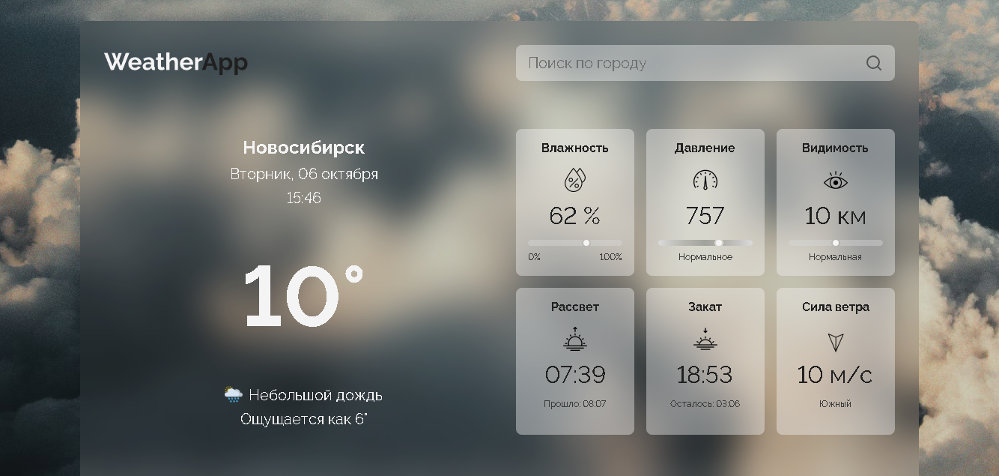
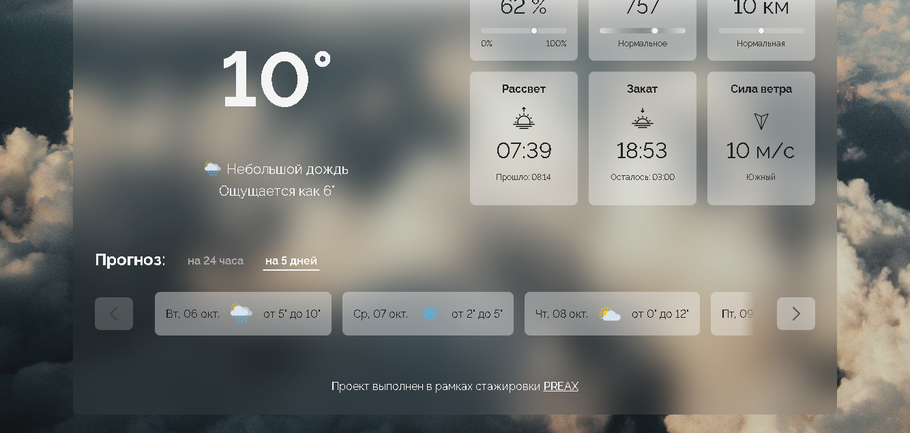
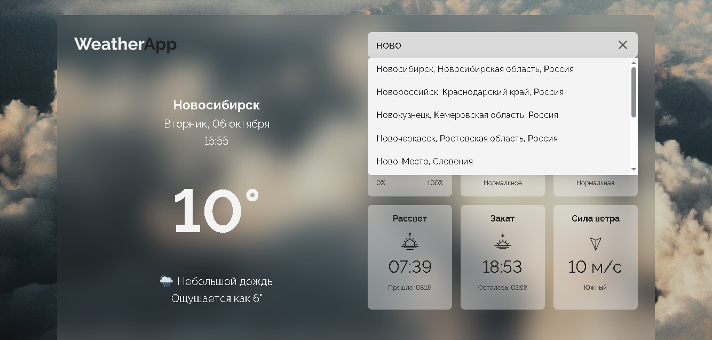

# WeatherApp - Приложение для просмотра погоды

Данный учебный проект представляет собой приложение для просмотра текущей погоды, а так же прогноза на сутки и на 5 дней, с возможностью поиска по городу.

## Демо

🌐 [Открыть приложение](https://daryatash.github.io/weather-app/)

## Стек

- HTML, CSS, JavaScript (ES Modules)
- Mapbox Geocoding API — получение координат городов по названию
- OpenWeatherMap API — текущая погода и прогноз
- Netlify Functions — прокси для защиты API-ключей

## Архитектура

Фронтенд на GitHub Pages → прокси на Netlify → внешние API.
Ссылка на прокси: https://weather-proxy-daryatash.netlify.app/.netlify/functions/geocode?q=Москва
API-ключи хранятся в Environment Variables на Netlify.

## Возможности

- Определение местоположения по геолокации
- Поиск городов с автодополнением
- Отображение текущей погоды с подробными характеристиками: температура, влажность, давление, видимость, время рассвета и заката, сила и направление ветра
- Прогноз на 24 часа с отображением по 3 часа
- Прогноз на 5 дней с приблизительным диапазоном температур
- Сохранение определенного геолокацией или выбранного через поиск города в localStorage

## Скриншоты

- Главный экран

- Прогноз на 24 часа

- Прогноз на 5 дней

- Поиск
